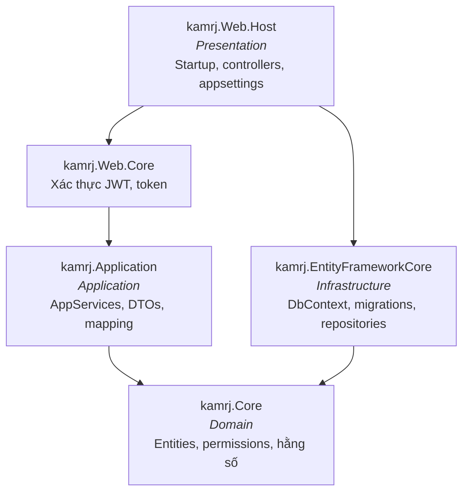

# ASP.NET Boilerplate là gì?

## Câu trả lời ngắn

**ASP.NET Boilerplate** (thường gọi tắt là **ABP**) là một framework dựng trên ASP.NET Core, cung cấp sẵn bộ khung cho những thứ mà **mọi** ứng dụng doanh nghiệp đều cần và không ai muốn viết lại: phân lớp kiến trúc, dependency injection, quản lý người dùng/vai trò/quyền, đa người thuê (multi-tenancy), ghi log kiểm toán, đa ngôn ngữ, hàng đợi tác vụ nền, và tự động sinh Web API.

Nói cách khác: bạn viết logic nghiệp vụ, ABP lo phần còn lại.

## Cảnh báo trước tiên: hai framework cùng tên "ABP"

Đây là nguồn nhầm lẫn lớn nhất, và nó sẽ làm bạn mất hàng giờ nếu không biết:

| | **ASP.NET Boilerplate** | **ABP Framework** |
|---|---|---|
| Còn gọi là | ABP "cũ", ABP classic | ABP.IO, ABP vNext |
| Namespace | `Abp.*` | `Volo.Abp.*` |
| Website tài liệu | `aspnetboilerplate.com` | `abp.io` |
| Gói NuGet | `Abp.AspNetCore` | `Volo.Abp.AspNetCore` |
| Quan hệ | Thế hệ trước | Viết lại từ đầu, **không tương thích ngược** |

**Repo này dùng ASP.NET Boilerplate `Abp.*` phiên bản 7.3.0, chạy trên .NET 6.** Kiểm tra bất cứ lúc nào bằng cách mở một file `.csproj` và xem `PackageReference`.

!!! danger "Hệ quả thực tế"
    Khi Google một vấn đề, bạn sẽ ra kết quả từ `abp.io` nhiều hơn — vì đó là sản phẩm đang được quảng bá. **Những kết quả đó thường không áp dụng được.** Hãy thêm từ khóa `aspnetboilerplate` vào truy vấn, hoặc tra thẳng tại `aspnetboilerplate.com/Pages/Documents`.

## Kiến trúc bốn lớp

ABP áp đặt (một cách nhẹ nhàng) mô hình phân lớp theo Domain-Driven Design. Trong repo, bốn lớp đó là bốn project:



Quy tắc chỉ có một, nhưng nghiêm ngặt: **mũi tên phụ thuộc luôn chĩa vào `Core`**. Lớp Domain không biết gì về database, cũng không biết gì về HTTP.

| Project | Chứa gì | Ví dụ trong repo |
|---|---|---|
| `kamrj.Core` | Entity, quyền, hằng số, interface domain | `Models/Layer.cs`, `Authorization/PermissionNames.cs` |
| `kamrj.Application` | Application service + DTO + cấu hình AutoMapper | `Models/FeatureModel/FeatureAppService.cs` |
| `kamrj.EntityFrameworkCore` | `DbContext`, migrations, cấu hình EF | Cấu hình `UseSqlServer(..., x => x.UseNetTopologySuite())` |
| `kamrj.Web.Host` | Điểm khởi chạy, Swagger, cấu hình | `Startup.cs`, `appsettings.json` |
| `kamrj.Migrator` | Ứng dụng console chạy migration | Hữu ích khi có nhiều tenant |

## Bốn thứ ABP làm cho bạn (và vì sao nó đáng học)

### 1. Tự động sinh Web API

Bạn **không viết controller**. Viết một class kế thừa `ApplicationService` (hoặc implement `IApplicationService`), ABP tự dựng endpoint HTTP cho từng phương thức public.

```csharp
public class FeatureAppService : AsyncCrudAppService<Feature, FeatureDto, int>, IFeatureAppService
{
    public FeatureAppService(IRepository<Feature, int> repository) : base(repository) { }

    public async Task<List<FeatureDto>> GetFeatureByLayerIdAsync(int layerId)
    {
        var features = await Repository.GetAllListAsync(f => f.LayerId == layerId);
        return ObjectMapper.Map<List<FeatureDto>>(features);
    }
}
```

Đoạn trên — chính là code thật trong repo — tự động tạo ra:

- `GET /api/services/app/Feature/GetAll`, `Get`, `POST .../Create`, `PUT .../Update`, `DELETE .../Delete` (do kế thừa `AsyncCrudAppService`)
- `GET /api/services/app/Feature/GetFeatureByLayerId?layerId=5` (phương thức tự viết)

Động từ HTTP được suy ra từ **tiền tố tên hàm**: `Get*` → GET, `Create*`/`Post*` → POST, `Update*`/`Put*` → PUT, `Delete*`/`Remove*` → DELETE. Hậu tố `Async` bị lược bỏ khỏi tên route.

### 2. Dependency injection theo quy ước

Không có file nào đăng ký `services.AddScoped<IFeatureAppService, FeatureAppService>()`. ABP quét assembly và tự đăng ký: một class tên `FeatureAppService` implement `IFeatureAppService` sẽ được ghép cặp tự động. Class implement `ITransientDependency` hay `ISingletonDependency` cũng vậy.

Bạn chỉ cần khai báo tham số ở constructor và nhận về đúng thứ mình cần.

### 3. Repository và Unit of Work

`IRepository<Feature, int>` được cung cấp sẵn cho **mọi** entity, không cần viết dòng nào: `GetAllListAsync`, `FirstOrDefaultAsync`, `InsertAsync`, `UpdateAsync`, `DeleteAsync`, và `GetAll()` trả về `IQueryable` để bạn tự viết truy vấn LINQ.

Quan trọng hơn: mỗi request web tự động được bọc trong **một Unit of Work** — một transaction database. Thành công thì commit, ném exception thì rollback. Bạn không gọi `SaveChanges()`, cũng không quản lý transaction thủ công.

### 4. ABP Zero — người dùng, vai trò, quyền, tenant

Gói `Abp.ZeroCore` mang sẵn toàn bộ mô hình dữ liệu và logic cho: tài khoản người dùng, vai trò, hệ thống phân quyền, đa người thuê, cấu hình hệ thống (settings), và nhật ký kiểm toán. Các bảng `AbpUsers`, `AbpRoles`, `AbpPermissions`, `AbpAuditLogs`, `AbpTenants` trong database đều đến từ đây.

Phân quyền được khai báo tập trung rồi kiểm tra bằng attribute:

```csharp
// kamrj.Core/Authorization/kamrjAuthorizationProvider.cs — khai báo quyền
context.CreatePermission(PermissionNames.Pages_Users, L("Users"));

// Áp dụng
[AbpAuthorize(PermissionNames.Pages_Users)]
public async Task<ListResultDto<UserDto>> GetAll() { ... }
```

Và cùng bộ quyền đó dùng lại được ở Angular: `*ngIf="permission.isGranted('Pages.Users')"`.

## Frontend nối với backend thế nào?

Đây là mảnh ghép cuối cùng của bức tranh, và nó khá đặc thù:

```
AppService C#  →  Swagger JSON  →  NSwag  →  service-proxies.ts  →  Angular component
```

File `angular/src/shared/service-proxies/service-proxies.ts` **được sinh tự động**, không sửa tay. Mỗi khi bạn thêm/đổi một application service hoặc DTO ở backend, phải chạy lại NSwag để proxy TypeScript được cập nhật. Bên cạnh đó, gói `abp-ng2-module` mang sang Angular các tiện ích của ABP: `abp.session` (người dùng hiện tại, tenant), `abp.auth.isGranted()` (kiểm tra quyền), `abp.localization` (đa ngôn ngữ), `abp.message` (hộp thoại).

---

Đã hiểu ABP là gì? Tiếp theo: [**cần học gì, cần biết gì**](lo-trinh-hoc.md).
