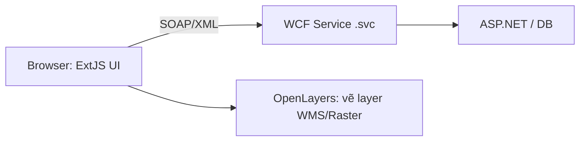
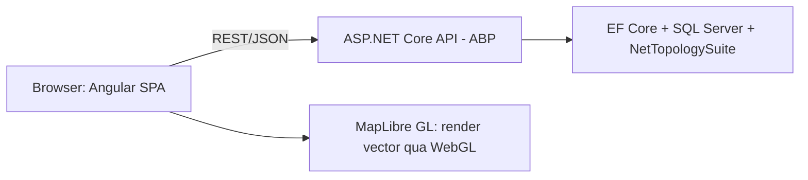

# Slide: Kiến trúc hệ thống GĐ3 và so sánh với GĐ2

!!! danger "Về số liệu hiệu năng"
    Nội dung dưới đây mô tả **đúng cấu trúc code hiện có** trong repo (ABP/.NET Core, Angular, MapLibre) và **lý do kỹ thuật** vì sao kỳ vọng nhanh hơn GĐ2. Các con số benchmark cụ thể (ms, TPS...) chưa có — cần đo thật trên cả 2 hệ thống trước khi đưa số liệu vào slide thật, để claim "vượt trội" có chứng cứ.

---

## Slide 1 — Trang bìa

**Kiến trúc hệ thống GIS thế hệ mới (GĐ3)**
So với GĐ2: WCF/ASP.NET + ExtJS + OpenLayers

---

## Slide 2 — GĐ2: kiến trúc hiện trạng

- **Backend:** WCF (Windows Communication Foundation) trên nền ASP.NET — giao tiếp qua SOAP/XML (`.svc`), cần WSDL.
- **Frontend:** ExtJS — framework desktop-in-browser, class `Ext.define`, `Store`/`Model` riêng, render toàn bộ UI bằng JS runtime nặng.
- **Bản đồ:** OpenLayers — vẽ layer chủ yếu qua raster/WMS hoặc canvas/DOM, không tận dụng vector tile + GPU rendering.
- **Đặc điểm chung:** mỗi lớp (backend/frontend/map) là công nghệ riêng biệt từ ~10+ năm trước, tích hợp thủ công, ít type-safety giữa client/server.



---

## Slide 3 — GĐ3: kiến trúc mới

- **Backend:** ASP.NET Core + **ABP Framework**, chia tầng rõ ràng:
    - `kamrj.Core` — domain entities (`Layer`, `Feature`, `Style`)
    - `kamrj.Application` — application services (`LayerAppService`, `FeatureAppService`)
    - `kamrj.EntityFrameworkCore` — EF Core + SQL Server (spatial qua NetTopologySuite)
    - `kamrj.Web.Host` — REST API (JSON, tự sinh Swagger)
- **Frontend:** Angular 12 SPA — service proxy sinh tự động từ Swagger (nswag) → gọi API có kiểu dữ liệu tường minh, không viết tay AJAX/XML.
- **Bản đồ:** MapLibre GL JS — render vector bằng WebGL (GPU), nhận trực tiếp GeoJSON qua REST API.



---

## Slide 4 — Mô hình dữ liệu bản đồ (đã có trong code)

```mermaid
erDiagram
    Layer ||--o{ Feature : "chứa"
    Layer ||--o{ Style : "định dạng"
    Feature {
        int Id
        string Name
        string Properties
        Geometry Geometry
    }
    Style {
        int Id
        string StyleJson
    }
```

- `Feature.Geometry` lưu trực tiếp bằng kiểu spatial của SQL Server (qua NetTopologySuite) — không cần parse WKT/WKB thủ công.
- `Style.StyleJson` cho phép đổi màu/ký hiệu layer **từ DB, không cần build lại code** — GĐ2/ExtJS thường hardcode style trong JS.
- API layer/feature là CRUD tự sinh (`AsyncCrudAppService<Layer, LayerDto, int>`) — không viết controller thủ công như WCF service contract.

---

## Slide 5 — Bảng so sánh trực tiếp

| Khía cạnh | GĐ2 | GĐ3 |
|---|---|---|
| Giao tiếp client–server | SOAP/XML qua WCF (`.svc`, WSDL) | REST/JSON, tự sinh client (nswag) |
| Frontend framework | ExtJS (nặng, toàn trang) | Angular SPA (component, lazy-load theo route) |
| Thư viện bản đồ | OpenLayers (raster/WMS phổ biến) | MapLibre GL (vector, GPU render qua WebGL) |
| Lưu style layer | Thường hardcode trong JS | `StyleJson` trong DB, đổi không cần deploy |
| Sinh API CRUD | Viết tay từng service WCF | Tự sinh qua ABP `AsyncCrudAppService` |
| Kiểu dữ liệu client/server | Không có type-safety (XML tự map) | Type-safe end-to-end (Swagger → TS interface) |
| Tương tác dữ liệu không gian | Xử lý WKT/WMS phía server thủ công | NetTopologySuite — geometry native trong EF Core |

---

## Slide 6 — Vì sao kỳ vọng nhanh hơn (lý do kỹ thuật)

- **SOAP → REST/JSON:** payload XML/SOAP envelope lớn hơn JSON đáng kể cho cùng dữ liệu → giảm băng thông + thời gian parse.
- **Raster/WMS → Vector tile GPU:** OpenLayers vẽ ảnh raster (mỗi lần pan/zoom tải lại ảnh); MapLibre vẽ vector bằng GPU, zoom/pan mượt hơn, không load lại ảnh.
- **Full-page ExtJS → Angular SPA:** load lần đầu nặng nhưng chuyển màn hình sau đó không reload toàn trang; lazy-load module giảm bundle ban đầu.
- **Style trong DB thay vì trong code:** đổi hiển thị layer không cần build/deploy lại frontend.

*(Đây là các lý do dựa trên đặc tính công nghệ đã biết, không phải số đo thực tế — vẫn cần benchmark để có số liệu cụ thể ở Slide 7.)*

---

## Slide 7 — Kế hoạch đo benchmark thật (trước khi báo cáo số liệu)

- [ ] Thời gian tải trang đầu (First Contentful Paint) — GĐ2 (ExtJS) vs GĐ3 (Angular).
- [ ] Thời gian render N feature trên bản đồ — OpenLayers vs MapLibre với cùng bộ dữ liệu.
- [ ] Thời gian phản hồi API lấy N feature — WCF (SOAP) vs ABP REST (JSON), cùng dataset, cùng máy chủ/network.
- [ ] Kích thước payload response cho cùng 1000 feature — XML vs JSON.
- Công cụ: Chrome DevTools Performance/Network, hoặc k6/JMeter cho load test API.

---

## Slide 8 — Kết luận & việc còn lại

- Kiến trúc GĐ3 đã có nền tảng domain (Layer/Feature/Style) + API CRUD + map rendering hoạt động (`layers.component.ts`).
- Còn thiếu: style layer từ `StyleJson` chưa áp dụng lên MapLibre, chưa có công cụ vẽ/tìm kiếm, chưa có số liệu benchmark thật.
- Đề xuất: chạy benchmark theo Slide 7 trước khi hoàn thiện slide "chứng minh hiệu năng vượt trội".
